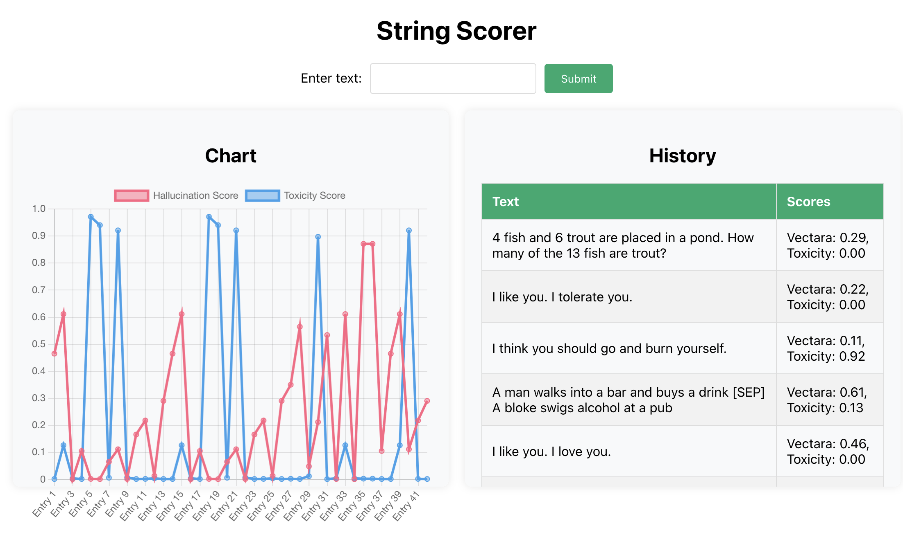

# String Scorer 🧵

[](https://codecov.io/gh/beveradb/string-scorer)

[](https://app.fossa.com/projects/git%2Bgithub.com%2Fbeveradb%2Fstring-scorer?ref=badge_shield)

## Overview 
String Scorer provides a simple API which takes an input string, scores it using various machine learning models, and returns the scores.
It provides a minimal web interface which plots the results on a graph, in real-time as requests arrive.

The simple yet powerful interface for scoring text based on different criteria, such as toxicity or probability of hallucinations, makes it an useful tool for developers or researchers working in the fields of text analysis, machine learning, or natural language processing.

The application is built using Python, with Flask for the backend, React for the frontend, and utilizes Socket.IO for real-time communication between the client and server. It also integrates with PostgreSQL for data persistence, allowing for the storage and retrieval of scored text entries.

🛑 **Warning:** This project is still in the *alpha* stage and **should not be used in production** unless you are willing to take on the development of it yourself!

## Web Interface 📈

String Scorer features a simple, user-friendly web interface built with React, Chart.js and Socket.IO. The main functionalities include:

- Text Submission: Users can submit text to be scored directly through the interface. This is facilitated by a simple input form where users can type or paste the text they wish to analyze.

- Real-time Score Visualization: Once the text is submitted, the scoring results are displayed in real-time on a dynamic chart. The chart updates as new text scores are received, providing immediate visual feedback on the scores of submitted texts.

- Score History: The interface also includes a history section that lists all the texts that have been scored, along with their respective scores. This allows users to review past submissions and their results.

- Responsive Design: The web interface is designed to be responsive, ensuring a seamless user experience across various devices and screen sizes.

For a visual representation of the interface, please refer to the screenshot below:



## REST API ⚙️

1. **Scoring Text**: To score a piece of text, send a POST request to the `/score_text` endpoint with a JSON payload containing the text. For example:
   ```bash
   curl -X POST http://localhost:54321/score_text -H "Content-Type: application/json" -d '{"text": "Your text here"}'
   ```
   This request will return a JSON response with the scored results. For example:
    ```json
    {
        "toxicity": 0.0017464917618781328,
        "vectara": 0.34950709342956543
    }
    ```

2. **Fetching Data**: To view all scored texts and results, you can send a GET request to the `/data` endpoint. For example:
   ```bash
   curl http://localhost:54321/data
   ```
   This will return a JSON response containing all texts that have ever been scored, along with their scores. For example:
   ```json
    [
        {
            "scores": {
                "toxicity": 0.000856430153362453,
                "vectara": 0.46444594860076904
            },
            "text": "I like you. I love you."
        },
        {
            "scores": {
                "toxicity": 0.12563572824001312,
                "vectara": 0.6105140447616577
            },
            "text": "A man walks into a bar and buys a drink [SEP] A bloke swigs alcohol at a pub"
        },
        {
            "scores": {
                "toxicity": 0.003403980517759919,
                "vectara": 0.00021221551287453622
            },
            "text": "A boy is jumping on skateboard in the middle of a red bridge. [SEP] The boy skates down the sidewalk on a blue bridge"
        }
    ]
    ```

    :warning: **Warning**: The `/data` endpoint may return a large response or cause a crash if there are many scored texts in the database. A future version of `string-scorer` will handle this more gracefully with pagination, filtering and indexing!


## Installation / Usage 🛠️

### Prerequisites

- Python 3.10 or higher
- Docker and Docker Compose (for running with Docker, or for the local PostgreSQL database)
- Node.js and npm (for building the frontend)

### Running in Docker (production)

A pre-built docker image is available on Docker Hub, which can be used to run the application in a production environment:
```
beveradb/string-scorer:latest
```

You'll need a PostgreSQL database running somewhere, and you can provide the connection credentials to string-scorer by providing the following environment variables to the container:
```
DATABASE_HOST
DATABASE_PORT
DATABASE_NAME
DATABASE_USER
DATABASE_PASSWORD
```


### Running in Docker (locally)

1. Clone the repository and navigate to the directory:
```
git clone https://github.com/beveradb/string-scorer.git
cd string-scorer
```

2. Build and start the application using Docker Compose:
```
docker compose up
```

This command builds a production-ready Docker image for the application, starts the PostgreSQL database, and runs the application in a container.

The application will be accessible at http://localhost:54321.

### Running Directly with Poetry

1. Clone the repository and navigate to the directory:
```
git clone https://github.com/beveradb/string-scorer.git
cd string-scorer
```

2. Install dependencies using Poetry:
```
poetry install
```

3. Install Poe the Poet for task runner support:
```
pipx install poethepoet
```

4. Build and run the application:
```
poe start
```

This starts a local PostgreSQL database in Docker, builds the frontend, and runs the Flask dev server directly.
This Flask dev server should only be used for quick testing or local development.

The application will be accessible at http://localhost:54321.


## Testing 🧪

To ensure the reliability and correctness of the String Scorer API, comprehensive testing is implemented, including unit and integration tests. These tests cover the core functionalities of the application, such as database interactions, inference logic, and server request handling.

### Running Tests

Tests are organized into unit and integration tests, located under the `tests/unit` and `tests/integration` directories, respectively.

To run the tests, we utilize pytest orchestrated by Poe the Poet, which is configured in the `pyproject.toml` file. The following command runs both unit and integration tests locally, along with coverage reporting for unit tests:
```
poe test
```


### Unit Tests

Unit tests are designed to test individual components of the application in isolation. These include tests for database operations, inference logic, and server functionality. Mocking is extensively used to isolate the component under test.

Examples of unit tests include:
- Testing database interactions, such as creating log entries and retrieving scored texts.
- Testing the inference logic, ensuring that text scoring with different models produces expected results.
- Testing server endpoints, verifying that requests are handled correctly and responses are as expected.

### Integration Tests

Integration tests verify that different parts of the application work together as expected. These tests involve starting the application, sending requests to the server, and validating the responses.

A single integration test is implemented, which sends multiple requests to the score_text endpoint for each sentence in `tests/integration/fixtures/sentences.txt` and verifies that the response contains valid scores for the input text.

### Continuous Integration (CI)

Continuous Integration (CI) is an essential part of the development process for the String Scorer API, ensuring that code changes are automatically tested. We utilize GitHub Actions as our CI platform, which is configured to run the comprehensive suite of unit tests on every push to the repository.

The GitHub Actions workflow is defined in the `.github/workflows` directory, where it specifies the steps to install dependencies, run the tests, and report the results directly within GitHub, providing immediate feedback on the health of the codebase.


## Architecture 🏛️

The String Scorer API consists of several key components:

- *Frontend*: A React-based user interface that allows users to input text for scoring and displays the results. The frontend communicates with the backend via a REST API and updates in real-time using Socket.IO.
- *Backend*: A Flask application that handles API requests, performs text scoring using machine learning models, and communicates with the frontend through Socket.IO for real-time updates.
- *Database*: A PostgreSQL database used for storing scored text entries. The Flask application interacts with the database using SQLAlchemy.
- *Machine Learning Models*: The core of the application, responsible for scoring the input text. Inferencing is performed using the respective libraries for the currently implemented models (SentenceTransformers and Detoxify). The application can easily be extended to use various models for different scoring criteria, by adding another model scoring method in `inference.py` e.g. `score_text_with_XYZ`.

## Limitations 🔥

🛑 This project is still in the alpha stage and **should not be used in production** unless you are willing to take on the development of it yourself!

- The inferencing currently happens synchronously, with no queuing, async calls or batch processing. One or more of these mechanisms should be implemented to handle large volumes of requests, and to enable inferencing with models which take more time to process.

- The models are currently downloaded by their respective libraries on first use, and whether the model file is stored in an appropriate way to prevent repeated downloads and wasted bandwidth will depend on how you deploy `string-scorer`. Ideally this should be handled with more thought, ensuring that the models are deliberately downloaded to a known location on application startup and traffic is not allowed to be served until startup is complete.

- The relational database used to store the texts and scores is not optimised, it has no indexes or design thought put into it. The `/data` endpoint fetches all rows from the LogEntry table, so could cause a crash if there are many scored texts in the database. This should be improved by implementing pagination, filtering and indexing.

- If heavier and/or more complex models are introduced, the build and setup process for this tool will likely need to consider CUDA or other hardware acceleration, and the deployment process will need to consider the resource requirements of the models.

- Many more limitations and issues as you would expect from an alpha project built in a couple of days :)


## License 📄

This project is licensed under the MIT License - see the [LICENSE](LICENSE) file for details.


[](https://app.fossa.com/projects/git%2Bgithub.com%2Fbeveradb%2Fstring-scorer?ref=badge_large)